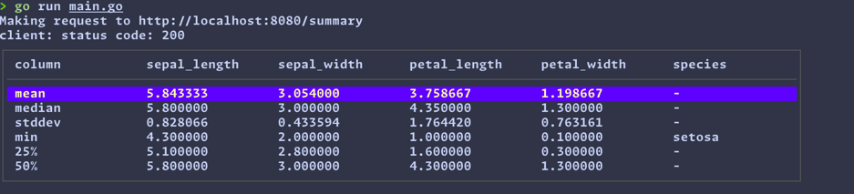
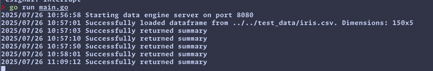

Start server:

Run `go run main.go` from the `/cmd` dir

Load data: 

From the `/cmd` dir 

```
curl -X POST -d '{"path":"../../test_data/iris.csv"}' http://localhost:8080/load
```

Get data:
```
curl http://localhost:8080/data
```
& has parameters: `start`, `limit`

Describe data:
```
curl http://localhost:8080/summary
```


TUI - from the `/tui` dir frun `go run main.go`





## TODO

### tui 
- [ ] add load data to server capabilities
- [ ] read from stdin + display in table
- [ ] variable column widths depending on data
- [ ] visual sugar: scrollbars, indexes
- [ ] interactivity: paging, scrolling left/right/up/down, filtering, selecting endpoint, sorting
- [ ] file browser?
- [ ] status bar
- [ ] other keyboard shortcuts (home/end, pgup/pgdown)
- [ ] row numbering
- [ ] help popup
- [ ] summary statistics like jetbrains/positron?

### server 
- [ ] read from stdin 
- [ ] add extra formats: json, parquet, duckdb, bigquery
- [ ] replace internals with duckdb
- [ ] add filtering and paging
- [ ] add sorting
- [ ] caching or compression?